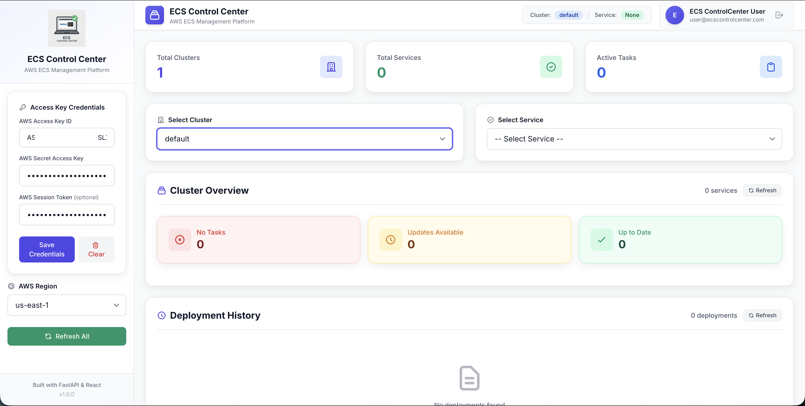

# ECS Control Center

A modern web application for managing Amazon ECS clusters, services, and tasks — with AWS Access Key authentication, cross-cluster Global Deploy, DynamoDB-backed Deployment History, and optional Dynatrace log integration.

## Features

- 🔐 **AWS Access Key Authentication** - Simple and secure credential-based authentication; paste an entire `[profile]`-style AWS credentials block into any one of the three credential fields and it auto-fills all three
- 🌍 **Global Deploy** - Deploy a service across every cluster in a region simultaneously, with per-cluster history and rollback
- 📈 **Dynatrace Log Integration** (optional) - Query Dynatrace Grail logs filtered by container, hostgroup, or image URI directly from the UI
- 📊 **Cluster Overview** - Monitor and manage ECS clusters with bulk deployment capabilities
- 🔄 **Smart Deployment** - Automatic handling of both numbered tags and "latest" tag deployments
- 📝 **Live & Historical Logs** - View container logs in real-time or query historical logs with timezone support
- 🚀 **Bulk Operations** - Deploy all services or restart services with "latest" tags
- 🌐 **Multi-Region Support** - Work across different AWS regions
- 📈 **Real-time Metrics** - Monitor cluster and service performance
- ⚙️ **Task Definition Editor** - Edit and update ECS task definitions with real-time validation
- 🎯 **Resource Management** - Flexible CPU/Memory allocation at task or container level
- 📋 **Deployment History & Rollback** - DynamoDB-backed persistent history with 14-day auto-expiry; rollback to any previous task definition revision
- 🔄 **Auto Image Updates** - Automatically populate latest Docker images when available
- 🛡️ **Smart Validation** - Prevents invalid configurations and ensures proper resource allocation
- ⏰ **Timezone Support** - View logs in multiple timezones (UTC, EST, PST, IST, EET, etc.)
- 🔁 **Trigger Restart**: Allows you to restart all ECS Services present in the selected ECS Cluster
- 🛠️ **Task Level Operations**:
    - 🆕 Allows user to trigger "Force New Deployment"
    - 🔢 Allows user to change the Task Count
- 🫧 **Clean and Simple UI** - Minimalist and Clean UI for ease of use

## Tech Stack

- **Frontend**: React 18, Tailwind CSS, Axios
- **Backend**: FastAPI, Python 3.9+
- **AWS Authentication**: AWS Access Key / Secret Key / Session Token
- **AWS Integration**: Boto3 (ECS, ECR, CloudWatch, DynamoDB)
- **History Storage**: Amazon DynamoDB
- **Log Integration**: Dynatrace Grail Logs API v2 (optional)
- **Containerization**: Docker & Docker Compose

## Prerequisites

- Node.js 16+ and npm
- Python 3.9+
- Docker and Docker Compose
- AWS Account with ECS access
- AWS Access Key ID and Secret Access Key (with appropriate permissions)
- (Optional) Dynatrace environment for log integration

## Quick Start

### 1. Clone the Repository

```bash
git clone <repository-url>
cd ecs-control-center
```

### 2. Environment Configuration

Copy the example file and fill in what you need — everything in it is optional for local development:

```bash
cp .env.example .env
```

**Frontend environment variables:**
```env
REACT_APP_API_BASE=http://localhost:8000
```

**Backend environment variables (all optional locally; set in the ECS task definition for production):**
```env
# Dynatrace log integration (optional) - leave blank to disable
DYNATRACE_ENV_URL=https://<env-id>.live.dynatrace.com
DYNATRACE_SSO_URL=https://sso.dynatrace.com/sso/oauth2/token
DYNATRACE_CLIENT_ID=<client-id>
DYNATRACE_API_TOKEN=<api-token>
DYNATRACE_ACCOUNT_URN=urn:dtaccount:<account-id>
# Optional, only needed if you use the Hostgroup log filter - see
# "Dynatrace Integration" below for exactly what these control
DYNATRACE_HOSTGROUP_PREFIX=
DYNATRACE_TENANT_CLUSTER_PREFIX=
DYNATRACE_TENANT_CLUSTER_SUFFIX=

# DynamoDB-backed deployment history
HISTORY_TABLE_NAME=ecs-control-center-history
HISTORY_AWS_REGION=us-east-1
```

**Note:**
- The `.env` file is optional for local development — the app works with none of this set (Dynatrace log queries simply report "not configured", and deployment history defaults to table `ecs-control-center-history` in `us-east-1`)
- For production, set these directly in the ECS task definition rather than committing a `.env` file
- The `.env` file is already in `.gitignore` so it won't be committed — never put real Dynatrace tokens or account identifiers in `.env.example` or any other committed file

### 3. Run the Application

```bash
docker-compose build && docker-compose up -d 
```

The application will be available at:
- Frontend: http://localhost:3000
- Backend API: http://localhost:8000

### Homepage of the Application will look like this:


Since the application doesn’t have authentication configured by default, you can access it by navigating to **[http://localhost:3000](http://localhost:3000)** once it’s running. However, when deploying to production, you can integrate Okta or another SSO provider for authentication.

## AWS Configuration

### 1. AWS Credentials

The application uses AWS Access Key authentication:

- **Access Key ID** (required) - Your AWS Access Key ID (starts with AKIA or ASIA)
- **Secret Access Key** (required) - Your AWS Secret Access Key
- **Session Token** (optional) - Required only for temporary credentials (ASIA keys)

**Paste a full credentials block:** instead of filling in the three fields individually, you can paste an entire `[profile]`-style AWS credentials chunk into any one of them:
```ini
[my-profile]
aws_access_key_id=ASIA...
aws_secret_access_key=...
aws_session_token=...
```
It's auto-detected and parsed into all three fields (a confirmation banner briefly confirms how many fields were filled). Pasting or typing a single plain value into a field still works exactly as before.

**Security Note:** 
- Credentials are stored in browser `localStorage` (client-side only)
- Credentials are never stored on the server
- Each user session has isolated credentials
- See [SECURITY.md](SECURITY.md) for detailed security information

### 2. Required AWS Permissions

Your AWS credentials need the following permissions:

```json
{
  "Version": "2012-10-17",
  "Statement": [
    {
      "Effect": "Allow",
      "Action": [
        "ecs:ListClusters",
        "ecs:ListServices",
        "ecs:ListTasks",
        "ecs:DescribeClusters",
        "ecs:DescribeServices",
        "ecs:DescribeTasks",
        "ecs:DescribeTaskDefinition",
        "ecs:RegisterTaskDefinition",
        "ecs:UpdateService",
        "ecs:StopTask",
        "ecr:DescribeRepositories",
        "ecr:DescribeImages",
        "ecr:GetAuthorizationToken",
        "ecr:BatchGetImage",
        "secretsmanager:GetSecretValue",
        "secretsmanager:DescribeSecret",
        "logs:DescribeLogGroups",
        "logs:DescribeLogStreams",
        "logs:GetLogEvents",
        "cloudwatch:GetMetricStatistics"
      ],
      "Resource": "*"
    }
  ]
}
```

**Additional Permissions for Task Definition Editor:**
- `ecs:RegisterTaskDefinition` - Create new task definition revisions
- `ecs:UpdateService` - Update services with new task definitions
- `ecr:DescribeRepositories` - List ECR repositories for image updates
- `ecr:DescribeImages` - Get image metadata for latest version detection
- `secretsmanager:GetSecretValue` - Access secrets for task definitions
- `secretsmanager:DescribeSecret` - Validate secret ARNs

### 3. ECS Task Role (Backend infrastructure)

Separately from the AWS credentials users paste into the UI, the backend service itself uses the **ECS Task Role** for DynamoDB access (deployment history). No user-supplied credentials are ever used for DynamoDB — the Task Role credentials are provided automatically by the ECS instance metadata service.

**Required Task Role permissions:**
```json
{
  "Effect": "Allow",
  "Action": [
    "dynamodb:PutItem",
    "dynamodb:GetItem",
    "dynamodb:UpdateItem",
    "dynamodb:Query",
    "dynamodb:CreateTable"
  ],
  "Resource": "arn:aws:dynamodb:<region>:<account-id>:table/ecs-control-center-history"
}
```

The table is created automatically on first backend startup if it doesn't already exist (requires `dynamodb:CreateTable`).

## Usage

### 1. Authentication

1. **Start the application**
2. **Enter AWS Credentials**:
   - **Access Key ID**: Your AWS Access Key ID
   - **Secret Access Key**: Your AWS Secret Access Key
   - **Session Token** (optional): Required only for temporary credentials
3. **Click "Save Credentials"** to authenticate
4. **Select Region** - Choose the AWS region you want to work with

### 2. Using the Application

1. **Enter AWS Credentials** - Provide your Access Key ID, Secret Key, and optional Session Token
2. **Select Region** - Choose the AWS region
3. **Select Cluster** - Choose an ECS cluster from the dropdown
4. **Cluster Overview** - View all services and their status
5. **Bulk Operations** - Deploy all services or restart services with "latest" tags
6. **Individual Deployment** - Deploy or restart specific services
7. **Global Deploy** - Deploy a single service suffix across every cluster in a region at once
8. **Task Definition Editing** - Edit task definitions with advanced resource management
9. **Deployment History** - Track deployments and perform rollbacks
10. **View Metrics & Logs** - Monitor performance and access real-time, historical, or Dynatrace logs

#### Key Features

- **Simple Authentication**: Just enter your AWS credentials - no complex setup required
- **Smart Deployment Detection**: Automatically detects if services use numbered tags or "latest" tags
- **Bulk Operations**: "Deploy All" for services with numbered tags, "Restart All" for "latest" tag services
- **Progress Tracking**: Real-time status updates during bulk operations
- **Advanced Task Management**: Complete task definition editing with validation
- **Resource Flexibility**: Choose between task-level or container-level resource allocation
- **Deployment Control**: Track history and perform safe rollbacks
- **Historical Logs**: Query CloudWatch logs with custom time ranges and timezone support

## Deployment Features

### Smart ECR Image Handling

The application intelligently handles both types of ECR images:

- **Numbered Tags** (e.g., `v1.2.3`): Updates task definition with new image URI
- **Latest Tags** (e.g., `latest`): Stops running tasks to force ECS to pull the new image with updated digest

### Bulk Operations

- **Deploy All**: Deploys all services with numbered tag updates
- **Restart All**: Restarts all services using "latest" tags with available updates
- **Progress Tracking**: Real-time status updates with success/failure counts

### Global Deploy (Cross-Cluster)

Deploy a single service suffix (e.g. `my-api`) across every cluster in a region simultaneously:

1. Open the **Global Deploy** tab
2. Select a service suffix and (optionally) an environment filter
3. Click **Deploy Across Clusters**

Each cluster deployment creates its own history record showing the exact cluster name and service name, with individual rollback capability.

## Logs Features

### Live Logs

- **Real-time Streaming**: View container logs as they're generated
- **WebSocket Connection**: Efficient real-time log streaming
- **Auto-refresh**: Configurable refresh intervals (1-60 seconds)
- **Download**: Export logs to a text file

### Historical Logs

- **Time Range Selection**: Quick ranges (1h, 2h, 6h, 12h, 24h) or custom date/time
- **CloudWatch Insights**: Uses CloudWatch Insights for efficient log querying
- **Timezone Support**: View logs in multiple timezones:
  - UTC (Coordinated Universal Time)
  - EST (Eastern Standard Time)
  - PST (Pacific Standard Time)
  - IST (Indian Standard Time)
  - EET (Eastern European Time)
  - And more...
- **Fallback Mechanism**: Automatically falls back to direct log stream queries if Insights fails

### Dynatrace Integration (Optional)

**Out of the box, this tool works entirely off native AWS services — CloudWatch Logs, ECS, ECR — with zero configuration.** The log source selector defaults to **CloudWatch**, so you get working logs immediately without touching Dynatrace at all.

Dynatrace is a purely optional, bonus integration for teams who already run a Dynatrace Grail tenant and want to query it without leaving this app. It only activates if you explicitly configure it (see Environment Configuration above), and it's compatible only if your Dynatrace setup follows the conventions below — read them before enabling it, since a mismatched convention just means empty results, not an error.

**Using it:**
1. Set `DYNATRACE_ENV_URL` + `DYNATRACE_API_TOKEN` (and `DYNATRACE_CLIENT_ID` for Grail/OAuth tenants)
2. Select a service, open **Live Logs**, and switch the source toggle from **CloudWatch** to **Dynatrace** or **Both**
3. Choose filter mode: Container ID, Hostgroup, or Image URI (combinable)
4. Set a time range (relative or absolute)

OAuth tokens are fetched and refreshed automatically — no manual token management. If Dynatrace isn't configured, switching to it just reports that plainly rather than failing silently.

**Compatibility — the exact queries this tool runs:**

Every Dynatrace query is built as:
```
fetch logs | filter <conditions> | sort timestamp desc | limit <n>
```
where `<conditions>` is an `AND` of whichever filters you enable, each using Grail DQL's `matchesValue()`:

| Filter | DQL condition | What it matches on |
|---|---|---|
| Container ID | `matchesValue(container.id, "<container_id>")` | The exact ECS/Docker container ID of the running task, read from ECS |
| Hostgroup | `matchesValue(dt.host_group.id, "<prefix><TENANT>")` | Dynatrace's `dt.host_group.id` field — see "tenant" derivation below |
| Image URI | `matchesValue(container.image.name, "<image-name-without-digest>*")` | Wildcard match on image name, digest stripped so it matches across deploys |

**This only works if your Dynatrace OneAgent host groups are actually named to match** — specifically, `dt.host_group.id` needs to equal `<DYNATRACE_HOSTGROUP_PREFIX><TENANT>` (uppercased), where:
- `DYNATRACE_HOSTGROUP_PREFIX` is whatever you set it to (empty by default — see Environment Configuration above)
- `<TENANT>` is derived from your ECS **cluster name**, with an optional leading/trailing segment stripped via `DYNATRACE_TENANT_CLUSTER_PREFIX` / `DYNATRACE_TENANT_CLUSTER_SUFFIX` (both empty by default, meaning no stripping — the full cluster name is used as the tenant). E.g. with prefix `myorg` and suffix `cluster`, cluster `myorg-acme-cluster` → tenant `acme`.

If your Dynatrace host groups aren't named this way, the Hostgroup filter just won't match anything — turn it off and rely on Container ID / Image URI instead, which don't depend on any naming convention at all.

## Task Definition Editor

### Advanced Task Definition Management

The Task Definition Editor provides comprehensive control over ECS task definitions with intelligent validation and real-time updates.

#### Key Features

- **⚙️ Complete Task Definition Editing**: Modify CPU, Memory, Environment Variables, Secrets, and Docker Images
- **🎯 Flexible Resource Management**: Choose between task-level or container-level resource allocation
- **🔄 Auto Image Updates**: Automatically populate latest Docker image URIs when updates are available
- **🛡️ Smart Validation**: Ensures valid configurations and prevents deployment failures
- **📋 Real-time Deployment**: Updates task definitions and deploys changes immediately
- **📊 Deployment Status**: Live tracking of deployment progress and status

#### Resource Management Options

**Task-Level Resources:**
- Set CPU and Memory at the task level
- All containers share the allocated resources
- Suitable for simple single-container services

**Container-Level Resources:**
- Set CPU and Memory for individual containers
- Fine-grained control over resource allocation
- Uses `memoryReservation` for optimal container management
- Suitable for multi-container services

**Validation Rules:**
- At least one level (task or container) must specify CPU/Memory
- Prevents invalid configurations that would cause deployment failures
- Real-time validation with clear error messages

#### Usage Workflow

1. **Select Service**: Choose an ECS service from the Cluster Overview
2. **Open Task Details**: Click on the service to view detailed information
3. **Edit Task Definition**: Click "⚙️ Edit Task Definition" button
4. **Configure Resources**: 
   - Clear task-level values to use container-level resources
   - Or set container-level values while keeping task-level resources
5. **Update Images**: Latest available images are automatically populated
6. **Modify Environment**: Add/remove environment variables and secrets
7. **Deploy Changes**: Click "🚀 Update & Deploy" to apply changes
8. **Monitor Progress**: Watch real-time deployment status and progress

#### Advanced Features

**Auto Image Population:**
- When editing a service with available image updates, the latest image URI is automatically populated
- Visual indicators show which containers have update availability
- Users can easily update to the latest versions

**Secrets Management:**
- View existing AWS Secrets Manager ARNs
- Add new secrets with proper ARN format validation
- Remove secrets by clearing the fields

**Environment Variables:**
- Add/remove environment variables dynamically
- Proper key-value pair validation
- Support for both simple values and complex configurations

**Deployment Integration:**
- Seamless integration with ECS service updates
- Real-time deployment status tracking
- Automatic service refresh after successful deployment
- Error handling with clear feedback messages

## Deployment History & Rollback

### Track and Manage Deployments

The application provides comprehensive, persistent deployment tracking and rollback capabilities for better operational control.

#### Features

- **📋 Deployment History**: Track all deployments with timestamps and status, persisted in DynamoDB (survives backend restarts)
- **🔄 One-Click Rollback**: Rollback to previous task definition revisions
- **📊 Status Monitoring**: Real-time deployment status tracking
- **🎯 Selective Rollback**: Choose specific task definition revisions to rollback to
- **⏳ 14-Day Auto-Expiry**: Records are purged automatically via DynamoDB TTL

#### How It Works

1. **DynamoDB-Backed Tracking**: Every deployment is written to a DynamoDB table (`HISTORY_TABLE_NAME`, default `ecs-control-center-history`), created automatically on first backend startup if it doesn't exist
2. **Status Updates**: The backend polls ECS `describeServices` to detect the primary deployment's rollout state, transitioning records from `IN_PROGRESS` → `COMPLETED` / `FAILED`
3. **Rollback Options**: Access rollback functionality from the deployment history
4. **Safe Rollback**: Validates task definition compatibility before rollback

#### Usage

1. **View History**: Access deployment history from the service details — sorted newest-first
2. **Monitor Status**: Track current deployment progress in real-time
3. **Details**: View the task definition diff and deployment metadata for any record
4. **Rollback**: Click rollback button next to any previous deployment
5. **Confirm**: Confirm rollback to previous task definition revision

#### DynamoDB Schema

| Attribute | Type | Description |
|-----------|------|-------------|
| `pk` | String (HASH) | Always `"HISTORY"` |
| `sk` | String (RANGE) | `deployment_id` — unique per deployment event |
| `timestamp` | String | ISO-8601 UTC creation time |
| `cluster` | String | ECS cluster name |
| `service` | String | ECS service name |
| `region` | String | AWS region of the deployment |
| `action_type` | String | `deploy`, `rollback`, `force_restart`, `global_deploy`, etc. |
| `status` | String | `IN_PROGRESS`, `COMPLETED`, `FAILED`, `UNKNOWN` |
| `username` | String | Set from the optional `X-User-Name` request header, or `"unknown"` if not provided |
| `email` | String | Set from the optional `X-User-Email` request header, or `"unknown"` if not provided |
| `ttl` | Number | Unix epoch timestamp 14 days after creation — DynamoDB auto-deletes expired records |

Table settings: `PAY_PER_REQUEST` billing, TTL enabled on the `ttl` attribute, region from `HISTORY_AWS_REGION` (default `us-east-1`).

Since this repo doesn't include a login system, `username`/`email` will show as `"unknown"` unless you set the `X-User-Name`/`X-User-Email` request headers yourself (e.g. via a reverse proxy, or your own auth layer in front of this app).

## Troubleshooting

### Common Issues

#### AWS Authentication Errors
- **Invalid Credentials**: Verify your Access Key ID and Secret Access Key are correct
- **Expired Credentials**: If using temporary credentials (ASIA keys), ensure the Session Token is provided and not expired
- **Insufficient Permissions**: Check that your AWS credentials have the required IAM permissions (see AWS Configuration section)
- **Region Issues**: Ensure the selected region is correct and accessible with your credentials
- **Network Errors**: If you see "Network Error", check that credentials are being sent correctly (they're sent in POST request bodies, not URL parameters)

#### Deployment Errors
- Check that the ECS service has the required IAM permissions
- Verify that the ECR repository exists and is accessible
- Ensure the task definition is valid

#### Task Definition Editor Issues
- **Validation Errors**: Ensure either task-level or container-level CPU/Memory is specified
- **Image Update Issues**: Verify ECR repository access and image tag availability
- **Secrets Management**: Check AWS Secrets Manager ARN format and permissions
- **Resource Allocation**: Ensure total container resources don't exceed task limits

#### Deployment History Issues
- **Records not appearing**: check backend logs for DynamoDB write errors; verify the ECS Task Role has `dynamodb:PutItem` and `dynamodb:Query`
- **Rollback Failures**: Verify that the target task definition revision still exists in AWS
- **Status Updates**: Check network connectivity for real-time status updates
- **Status stuck at IN_PROGRESS**: verify the deployment's `region` field is populated in DynamoDB and that the Task Role can reach ECS in that region
- **Table schema errors**: the table must have `pk` (HASH, String) and `sk` (RANGE, String); if it was created with a different schema, delete it and let the backend recreate it on next startup

#### Dynatrace Log Issues
- **No results**: verify `DYNATRACE_ENV_URL`, `DYNATRACE_CLIENT_ID`, and `DYNATRACE_API_TOKEN` are set (see Environment Configuration above)
- **OAuth errors**: check that the Dynatrace OAuth client has `storage:logs:read` and `storage:buckets:read` scopes on the correct account URN
- **Image filter not matching**: the app strips the digest from image URIs and uses a wildcard match so tag-only names match regardless of digest
- **Hostgroup filter returns nothing**: your Dynatrace host groups likely aren't named to match this tool's convention — see "Dynatrace Integration (Optional)" above for the exact `dt.host_group.id` value expected, or just turn off the Hostgroup filter and use Container ID / Image URI instead
- **Dynatrace not needed?** — leave it unconfigured entirely; the app works fully on CloudWatch out of the box (this is the default)

## Production Deployment

The application is designed to run on AWS ECS with:
- Access Key authentication for AWS API access
- Load balancer for high availability
- HTTPS for secure credential transmission

### Prerequisites
- AWS CLI configured with appropriate permissions
- ECR repositories for storing Docker images
- VPC and Subnets already present
- IAM Role with Policy already created with permissions mentioned above
- ECS Cluster
- SSL/TLS certificate for HTTPS (required for secure credential transmission)

### Deploying the Application to AWS
- **deployment_files** directory contains a Shell script that can be used to automate deployment of this application on AWS ECS.
- deploy_to_ecs.sh script is baseline script which can be modified to suit your usecase. It assumes VPC, Subnets and IAM Role is already present in the AWS Account where you want to deploy and uses HTTP (80) / HTTPS (443) Listener of ALB.
- The script also prompts for the DynamoDB history table name/region and (optionally) Dynatrace log integration settings, and writes them into the generated task definitions — leave the Dynatrace prompts blank if you don't want that feature. Make sure the IAM Role you provide also has the DynamoDB permissions listed above if you want deployment history to work.

#### Since we use AWS Credentials, it is highly advisable to use HTTPS (443) Listener of ALB with SSL/TLS Certificate using ACM


### Key ECS Features
- **Access Key Authentication**: Users provide their own AWS credentials
- **Multi-Container Task**: Both frontend and backend in single task
- **Fargate Compatible**: Serverless container execution
- **CloudWatch Logging**: Centralized logging
- **Stateless Backend**: No credential storage on the server

### Authentication for Production
- Users enter their AWS Access Key credentials directly in the web interface
- Credentials are stored only in browser `localStorage` (client-side)
- Backend never stores credentials - each request includes credentials in the request body
- HTTPS is required to protect credentials in transit

## Security Considerations

- **HTTPS Required**: Always use HTTPS in production to protect credentials in transit
- **AWS IAM**: Use least-privilege IAM policies for Access Keys
- **Credential Storage**: Credentials are stored in browser `localStorage` only (client-side)
- **Multi-User Isolation**: Each browser session has isolated credentials
- **No Server Storage**: Backend is stateless and never stores credentials
- **Session Tokens**: Temporary credentials (ASIA keys) require Session Tokens
- **Shared Computers**: Users should clear credentials when using shared computers
- **Environment Variables**: Never commit sensitive data to version control

For detailed security information, see [SECURITY.md](SECURITY.md).
